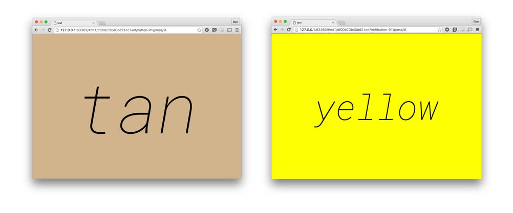

# realtime-text

A simple frontend data demo



### Usage

1. visit https://pusher-community.github.io/realtime-text/
2. type stuff


### Usage with pusher events

configure via the document hash:

    https://pusher-community.github.io/realtime-text/#CLUSTER/KEY/CHANNEL/EVENT/JSON_KEY

for example, with a [button](http://button.pusher.io/):

    https://pusher-community.github.io/realtime-text/#mt1/df00b73b40dd21cc7eef/button-NUMBER/press/id

will print the value of `id` ("12") given the message:

```json
{
    "id":12,
    "timestamp": 1234567
}
```
